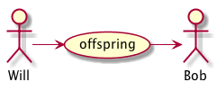

Genealogical Tree
=================

## Summary

Program should be able to **find all the descendant with name Bob for all the ascendants with name Will on any level of ancestry**. In order to present the capabilities of your app:

- implement the application to optimize the initialization time
- application should have built in data about genealogical tree of people living in particular country
- please generate a representative data that has sample people an relationships between them. Use all varieties of names (can be also generated) but also put two test names (Bob and Will) and connect them in different relationships.
- the application should posses tests that are checking possible edge cases and ensure the stability of the application.
- the designed data structure should ensure optimized search time on following fields: name, last name, date of birth and location.

## Generate binaries & documentation

Usual commands:

          mkdir -p build
          cd build
          cmake ..
          make
          make install
          make doc

## Development details

In order to generate binaries & documentation, the following versions were used:

### For code

#### *Linux*

- **cmake** *2.8.11*
- **gcc** *4.8.3*
- **boost** *1.53.0*

#### *OSX*

- **cmake** *3.2.2*
- **gcc** *5.1*
- **boost** *1.58*

**Note:** If you happen to work with *OSX* and [Homebrew](http://brew.sh), don't forget to compile **boost** with the previous **gcc** compiler, not with the default *clang* one:

          brew install gcc
          brew install boost --cc=gcc-5
         

### For documentation

#### *Linux*

- **doxygen** *1.8.5*
- **latex/pdfTeX** *3.1415926-2.5-1.40.14*
- **graphviz/dot** *2.30.1*
- **java/plantuml** *1.7.0_79/8026*

#### *OSX*

- **doxygen** *1.8.9.1*
- **latex/pdfTeX** *3.14159265-2.6-1.40.15*
- **graphviz/dot** *2.38.0*
- **java/plantuml** *1.8.0_40/8026*

**Note:** Don't forget configure *Doxyfile* and *CMakeLists.txt* to use **README.md** as *Main Page* for **latex** documentation. 

As well generating images out of comments and including them into *markdown* and *latex* formats require some extra details:

<!--- 
@startuml image/example.png
  Will -> (offspring)
  (offspring) -> Bob
@enduml
--->

- **README.md** *(see source code)*

         \image latex image/example.png width=140px

         HTML Commented PlantUML code for image/example.png

- **Doxyfile**

         USE_MDFILE_AS_MAINPAGE = README.md "Genealogical Tree"
         INPUT                  = . src test
         IMAGE_PATH             = image
         INPUT_FILTER           = "sed 's/^\!\[\(.*\)\](.*)$/\1/g'"
         LATEX_OUTPUT           = doc/latex
         PLANTUML_JAR_PATH      = 
         PLANTUML_INCLUDE_PATH  = 
         
- **CMakeLists.txt**

         set(PLANTUML java -jar /opt/plantuml/plantuml.jar)
         set(PDF_FILE ${PROJECT_SOURCE_DIR}/${CMAKE_PROJECT_NAME}.pdf)

         # make doc
         add_custom_target( doc mkdir -p ${PROJECT_SOURCE_DIR}/doc 
          COMMAND ${PLANTUML} ${PROJECT_SOURCE_DIR}/README.md
          COMMAND ${PLANTUML} ${PROJECT_SOURCE_DIR}/src
          COMMAND ${PLANTUML} ${PROJECT_SOURCE_DIR}/test
          COMMAND ${DOXYGEN_EXECUTABLE} ${PROJECT_SOURCE_DIR}/Doxyfile
          COMMAND rm -rf ${PDF_FILE} 
          COMMAND make -f ${PROJECT_SOURCE_DIR}/doc/latex/Makefile -C ${PROJECT_SOURCE_DIR}/doc/latex
          COMMAND mv ${PROJECT_SOURCE_DIR}/doc/latex/refman.pdf ${PDF_FILE}
          COMMAND rm -rf ${PROJECT_SOURCE_DIR}/doc
          WORKING_DIRECTORY ${PROJECT_SOURCE_DIR}
         
**Note:** Take into account that *Doxygen PlantUML* task was deactivated at **Doxyfile** and activated just at **CMakeLists.txt** in order to let us to save generated *images* and include them choosing their **size**.
 
### For IDE 

To use **NetBeans** don't forget to configure a *cmake* project with *custom* **build** folder. *PlantUML* and *markdown* plugins might be handy as well.

**Note:** If you happen to use *jVi* plugin on *OSX*, don't forget to use **-lc** instead of just **-c** for its */bin/bash* flag. Define a target to show the *PDF* generated with the latest documentation information:

- **CMakeLists.txt**

         # make show
         if(APPLE)
           add_custom_target( show open -a Preview ${PDF_FILE} DEPENDS doc )
         elseif(UNIX)
           add_custom_target( show evince ${PDF_FILE} DEPENDS doc )
         endif()

- **jVi**

         :!~/show

- **~/show**

         #!/bin/bash

         # CURRENT NETBEANS PROJECT
         CNP=$HOME/Code/GenealogicalTree/build

         make show -f $CNP/Makefile -C $CNP

 
