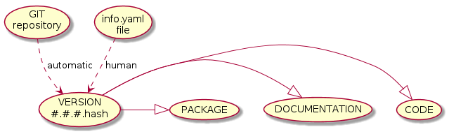

Genealogical Tree
=================

## Summary

Program should be able to **find all the descendant with name Bob for all the ascendants with name Will on any level of ancestry**. In order to present the capabilities of your app:

- implement the application to optimize the initialization time
- application should have built in data about genealogical tree of people living in particular country
- please generate a representative data that has sample people an relationships between them. Use all varieties of names (can be also generated) but also put two test names (Bob and Will) and connect them in different relationships.
- the application should posses tests that are checking possible edge cases and ensure the stability of the application.
- the designed data structure should ensure optimized search time on following fields: name, last name, date of birth and location.

## Expected installed software

A Modern C++ GNU compiler, *g++* 4.9.2 or above, and a recent *cmake*, 3.1 or above, are the minimum for binaries. As well a valid *boost* library is supposed to be installed.

Regarding to documentation, *doxygen*, *latex*, *graphviz* and *plantuml.jar* are needed. For example, if you work with Xubuntu 15.04 or its **Docker** equivalent, the following commands might do the trick for you:
    
          sudo apt-get -y install git build-essential libboost-all-dev doxygen doxygen-latex openjdk-8-jdk graphviz
          sudo add-apt-repository -y ppa:george-edison55/cmake-3.x
          sudo apt-get -y update
          sudo apt-get -y install cmake
          sudo apt-get -y upgrade
          sudo mkdir /opt/plantuml && sudo chmod a+wr /opt/plantuml
          wget http://sourceforge.net/projects/plantuml/files/plantuml.jar/download -O /opt/plantuml/plantuml.jar

For other O.S., have a look to [Homebrew](http://brew.sh) or [Git](https://git-scm.com/download/win)/[MinGW](http://nuwen.net/mingw.html)  

## Generate binaries & documentation

Usual commands:

          mkdir build
          cd build
          cmake ..
          make
          make install
          make doc

<!---
@startuml image/cmake.png
left to right direction
(version.h) <|-- (template\nCMakeLists.txt)   
(Doxyfile) <|-- (template\nCMakeLists.txt) : generate  
(template\nCMakeLists.txt) <.. (version.h.in) 
(template\nCMakeLists.txt) <.. (Doxyfile.in) : template 
(root\nCMakeLists.txt) <-- (version.h) 
(root\nCMakeLists.txt) <-- (Doxyfile) : Git\nCommit\nHash
(Doxyfile) <.. (root\nREADME.md) : include
note left of (root\nCMakeLists.txt): **binaries**\nmake\nmake install
note left of (root\nCMakeLists.txt): **documents**\nmake doc\nmake show 
@enduml
--->

**Note:** If you happen to work with *OSX* and [Homebrew](http://brew.sh), don't forget to invoke *cmake* pointing to the **GNU** compiler:

          cmake -DCMAKE_CXX_COMPILER=g++-5 ..

**Note:** If you happen to work with *Windows* and [Git](https://git-scm.com/download/win)/[MinGW](http://nuwen.net/mingw.html), don't forget to invoke *cmake* pointing to the **GNU** generator:

          cmake -G "MSYS Makefiles" ..

As well a script, called **show** or something similar, will be created in your *home* directory as a shortcut for generating & viewing documentation. Don't hesitate to use it as a *template* for your specific environment.

## Generate only documentation

Similar commands to the previous ones:

          mkdir build
          cd build
          cmake -DONLY_DOC=TRUE ..
          make doc

**Note:** If you happen to work with *Windows* and [Git](https://git-scm.com/download/win)/[MinGW](http://nuwen.net/mingw.html), don't forget to invoke *cmake* pointing to the **GNU** generator:

          cmake -G "MSYS Makefiles" -DONLY_DOC=TRUE ..

## Development details

In order to generate binaries & documentation, the following versions were used:

### For code

Pay attention to *cmake* and *gcc* versions. A minimum is required to work on several O.S. using modern C++. Feel free to locally hack **CMakeLists.txt** to meet your needs.

#### *Linux* ( Xubuntu 15.04 )

- **cmake** *3.1.3*
- **gcc** *4.9.2*
- **boost** *1.55*

#### *OSX* ( Yosemite 10.10.3 )

- **cmake** *3.2.2*
- **gcc** *5.1*
- **boost** *1.58*

**Note:** If you happen to work with *OSX* and [Homebrew](http://brew.sh), don't forget to compile **boost** with the previous **gcc** compiler, not with the default *clang* one:

          brew install gcc
          brew install boost --cc=gcc-5
         
#### *Windows* ( Win7 x64 )

 - **cmake** *3.3.0*
 - **gcc** *5.1*
 - **boost** *1.58*

### For documentation

Environment variables to locate PlantUML *jar* and default *PDF* viewer can be defined to overwrite default values. See **CMakeLists.txt** for further information on your platform.

#### *Linux*

- **doxygen** *1.8.9.1*
- **latex/pdfTeX** *2.6-1.40.15*
- **graphviz/dot** *2.38.0*
- **java/plantuml** *1.8.0_45/8026*

#### *OSX*

- **doxygen** *1.8.9.1*
- **latex/pdfTeX** *2.6-1.40.15*
- **graphviz/dot** *2.38.0*
- **java/plantuml** *1.8.0_40/8026*

#### *Windows*

 - **doxygen** *1.8.9.1*
 - **latex/pdfTeX** *2.9.5496-1.40.15*
 - **graphviz/dot** *2.38.0*
 - **java/plantuml** *1.8.0_45/8026*

**Note:** Don't forget configure *Doxyfile* and *CMakeLists.txt* to use **README.md** as *Main Page* for **latex** documentation. 

### For IDE 

To use **NetBeans** don't forget to configure a *cmake* project with *custom* **build** folder. Add at that moment any extra customization in the command line used by *cmake* instruction. For example:

 - -DCMAKE_CXX_COMPILER=g++-5 for **OSX**
 - -DONLY_DOC=TRUE for only documentation on **Linux/OSX**
 - -G "MSYS Makefiles" for **Windows**
 - -G "MSYS Makefiles" -DONLY_DOC=TRUE for only documentation on **Windows**

**Note:** If you happen to use *jVi* plugin on *OSX*, don't forget to use **-lc** instead of just **-c** for its */bin/bash* flag. 

## GIT Commit Hash

In order to add the specific **git commit hash** into code & documentation, *templates* are defined in the *template* folder for **Doxyfile** & **version.h** files.

