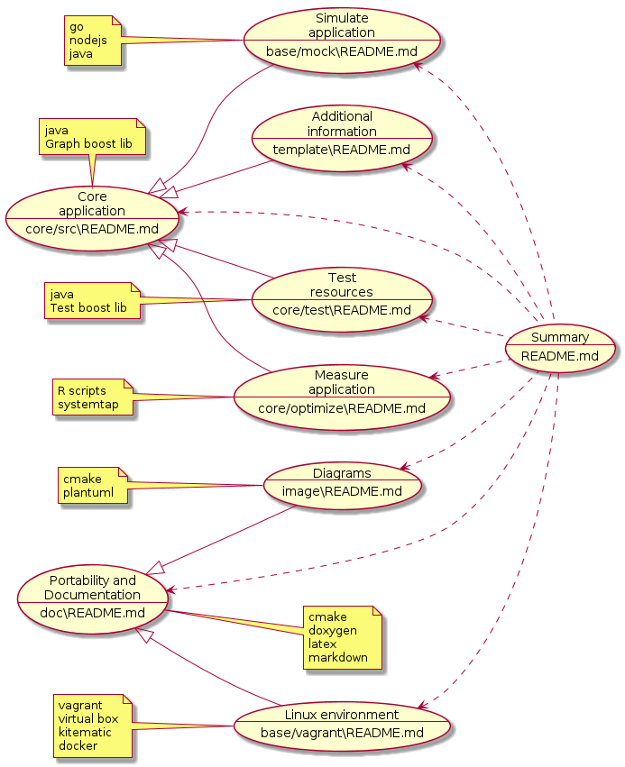

# Genealogical Tree 

## Summary 

Program should be able to **find all the descendant with name Bob for all the ascendants with name Will on any level of ancestry**. In order to present the capabilities of your app:

- implement the application to optimize the initialization time.
- application should have built in data about genealogical tree of people living in particular country.
- please generate a representative data that has sample people an relationships between them. Use all varieties of names (can be also generated) but also put two test names (Bob and Will) and connect them in different relationships.
- the application should posses tests that are checking possible edge cases and ensure the stability of the application.
- the designed data structure should ensure optimized search time on following fields: name, last name, date of birth and location.

## Approach 

Instead of starting directly with the problem core, don't test thoroughly edge cases, leaping into too early optimization, don't document your results/decisions/mistakes and ending with an app that only run partially on your development environment, the **aproach** will be the opposite one. 

1. [Ensure a minimum of portability](doc/README.md) on different environments.
2. [Generate diagrams from codex and documentation](image/README.md) to be able to track down all the changes.
3. [Use templates to gather external information](template/README.md) to document as much automatically as possible.
4. [Write tests](test/README.md) to cover your app and let you  optimize knowing you're not breaking previous development.
5. [Measure your application](optimize/README.md) in order to compare improvements/regressions during the optimization stage.
6. [Solve the core problem](src/README.md) in the most simple and maintainable way at our disposal. 

<!---
@startuml approach.png
left to right direction
(Portability and\nDocumentation\n--\ndoc\README.md) as (Doc)
(Diagrams\n--\nimage\README.md) as (Image)
(Additional\ninformation\n--\ntemplate\README.md) as (Template)
(Test\nresources\n--\ntest\README.md) as (Test)
(Summary\n--\nREADME.md) as (Summary)
(Measure\napplication\n--\noptimize\README.md) as (Measure) 
(Core\napplication\n--\nsrc\README.md) as (Core)
(Doc) <.. (Summary)
(Template) <.. (Summary)
(Image) <.. (Summary)
(Test) <.. (Summary)
(Measure) <.. (Summary)
(Core) <.. (Summary)
(Core) <|-- (Template)
(Core) <|-- (Test)
(Core) <|-- (Measure)
note left of (Doc): cmake\ndoxygen\nlatex\nmarkdown 
note left of (Image): cmake\nplantuml 
note left of (Measure): R scripts 
note top of (Core): Graph boost lib
note left of (Test): Test boost lib
@enduml
--->

No doubt this approach is an overkill for a pet project but it's way more realistic for big, long C++ ones. 
